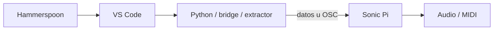

# Glitxtober Automation Scripts

Automatizaciones de producción para **Glitxtober 2026 — Código y Síntesis**. El repositorio convierte los snapshots editoriales de cada episodio en una secuencia reproducible para cámara: Hammerspoon controla Sonic Pi, escribe/edita el código, ejecuta cada beat y registra el estado fuera de la pantalla grabada.

## Arquitectura general


Los episodios que necesitan código externo se reservan para una etapa posterior con VS Code:



## Inventario por episodio

| Ep. | Episodio | Estado | Runner / TODO | Código original |
| --- | --- | --- | --- | --- |
| 01 | Código → sonido | ✅ Sonic Pi | [`runner.lua`](hammerspoon/episodes/01-codigo-sonido/runner.lua) | [`ORIGINAL.md`](hammerspoon/episodes/01-codigo-sonido/ORIGINAL.md) |
| 02 | La máquina decide el ritmo | ✅ Sonic Pi | [`runner.lua`](hammerspoon/episodes/02-maquina-decide-ritmo/runner.lua) | [`ORIGINAL.md`](hammerspoon/episodes/02-maquina-decide-ritmo/ORIGINAL.md) |
| 03 | Controlando un sinte desde el código | ✅ Sonic Pi + MIDI hardware | [`runner.lua`](hammerspoon/episodes/03-controlando-sinte/runner.lua) | [`ORIGINAL.md`](hammerspoon/episodes/03-controlando-sinte/ORIGINAL.md) |
| 04 | Construye tu propio secuenciador | ✅ Sonic Pi | [`runner.lua`](hammerspoon/episodes/04-secuenciador/runner.lua) | [`ORIGINAL.md`](hammerspoon/episodes/04-secuenciador/ORIGINAL.md) |
| 05 | Ritmos euclidianos | ✅ Sonic Pi | [`runner.lua`](hammerspoon/episodes/05-ritmos-euclidianos/runner.lua) | [`ORIGINAL.md`](hammerspoon/episodes/05-ritmos-euclidianos/ORIGINAL.md) |
| 06 | Un sample, cien sonidos | ✅ Sonic Pi | [`runner.lua`](hammerspoon/episodes/06-un-sample-cien-sonidos/runner.lua) | [`ORIGINAL.md`](hammerspoon/episodes/06-un-sample-cien-sonidos/ORIGINAL.md) |
| 07 | La imagen se convierte en música | 🟡 TODO VS Code / Python | [`README`](hammerspoon/episodes/07-imagen-musica/README.md) | [`ORIGINAL.md`](hammerspoon/episodes/07-imagen-musica/ORIGINAL.md) |
| 08 | Convierte tu trackpad en un instrumento | 🟡 TODO VS Code / Python + OSC | [`README`](hammerspoon/episodes/08-trackpad-instrumento/README.md) | [`ORIGINAL.md`](hammerspoon/episodes/08-trackpad-instrumento/ORIGINAL.md) |
| 09 | La computadora escucha y responde | 🟡 TODO VS Code / audio + OSC | [`README`](hammerspoon/episodes/09-computadora-escucha-responde/README.md) | [`ORIGINAL.md`](hammerspoon/episodes/09-computadora-escucha-responde/ORIGINAL.md) |
| 10 | Una máquina que hace música sola | ✅ Sonic Pi | [`runner.lua`](hammerspoon/episodes/10-maquina-musica-sola/runner.lua) | [`ORIGINAL.md`](hammerspoon/episodes/10-maquina-musica-sola/ORIGINAL.md) |

Cada directorio contiene un `README.md` con arquitectura, dependencias y decisiones de automatización. `ORIGINAL.md` conserva el código canónico de **cada fase/snapshot** antes de cualquier adaptación para cámara.

## Estructura

```text
.github/workflows/code-review.yml
README.md
docs/CODE_REVIEW.md
tests/review.lua
tools/review_repo.py
hammerspoon/
├── glitx_status.lua
├── init.lua.example
├── lib/
│   └── sonic_pi_runner.lua
└── episodes/
    ├── 01-codigo-sonido/
    │   ├── README.md
    │   ├── ORIGINAL.md
    │   └── runner.lua
    ├── 02-maquina-decide-ritmo/
    ├── 03-controlando-sinte/
    ├── 04-secuenciador/
    ├── 05-ritmos-euclidianos/
    ├── 06-un-sample-cien-sonidos/
    ├── 07-imagen-musica/
    ├── 08-trackpad-instrumento/
    ├── 09-computadora-escucha-responde/
    └── 10-maquina-musica-sola/
```

## Instalación

Clona el repositorio dentro de `~/.hammerspoon/` y usa `hammerspoon/init.lua.example` como referencia para tu `~/.hammerspoon/init.lua`.

Hammerspoon necesita permiso en **System Settings → Privacy & Security → Accessibility** para generar eventos de teclado.

## Seleccionar episodio

`init.lua` carga un solo runner a la vez:

```lua
GLITX_EPISODE = "04-secuenciador"
```

Después usa **Reload Config** en Hammerspoon y comienza una toma con `Ctrl + Alt + Cmd + R`.

Para EP03 configura el puerto que Sonic Pi muestra en Preferences → IO:

```lua
GLITX_EP03_CONFIG = {
  midiPort = "NOMBRE EXACTO DEL PUERTO",
}
```

## Estado: consola siempre, alertas opcionales

La Hammerspoon Console siempre recibe los mensajes. Las alertas están deshabilitadas por defecto:

```lua
GLITX_STATUS_CONFIG = {
  showAlerts = false,
  alertScreen = "secondary",
  recordingAppName = "Sonic Pi",
}
```

Si `showAlerts = true`, el router intenta usar una pantalla de control distinta a la pantalla donde está Sonic Pi. Si no existe, omite el overlay y mantiene sólo el log de consola.

## Controles comunes

| Hotkey | Acción |
| --- | --- |
| `Ctrl + Alt + Cmd + N` | Ejecutar el siguiente beat. |
| `Ctrl + Alt + Cmd + R` | Doble Stop, limpiar buffer y reiniciar toma. |
| `Ctrl + Alt + Cmd + I` | Consultar el siguiente beat. |
| `Ctrl + Alt + Cmd + X` | Cancelar y marcar la toma como desincronizada. |
| `Ctrl + Alt + Cmd + T` | Prueba mínima de escritura. |

## Motor compartido

`hammerspoon/lib/sonic_pi_runner.lua` concentra la lógica común: escritura carácter por carácter, `Return` conservador, pausas extra después de `sample`/`do`/`end`, separación de `live_loop`, navegación por líneas, `Tidy → Run`, doble Stop y control de estado.

Además, cada especificación se revisa **antes de enlazar hotkeys** mediante `Runner.reviewSpec()`. El review puro simula todos los beats sobre un modelo de texto y falla si un target no existe, una acción es inválida o el modelo viola las invariantes de separación/saltos de línea.

## Code review loop

El loop completo está documentado en [`docs/CODE_REVIEW.md`](docs/CODE_REVIEW.md). Localmente:

```bash
python3 tools/review_repo.py
luac5.4 -p hammerspoon/lib/sonic_pi_runner.lua
GLITX_ROOT=. lua5.4 tests/review.lua
```

GitHub Actions repite los mismos checks en cada push a `main` y en cada pull request. Después de CI verde, los episodios Sonic Pi requieren un smoke test real en macOS porque el CI no puede verificar Accessibility, la GUI de Sonic Pi, audio ni hardware MIDI.

## Fase VS Code

Los episodios 07, 08 y 09 conservan todo su código original, pero no tienen `runner.lua` todavía. Sus README contienen un `TODO` explícito para la etapa en la que Hammerspoon orquestará VS Code + Python + Sonic Pi.
