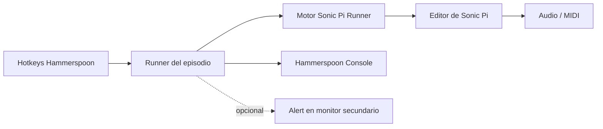
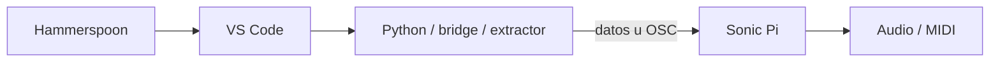

# Glitxtober Automation Scripts

Automatizaciones para preparar y grabar los episodios de **Glitxtober 2026 — Código y Síntesis**.

El objetivo del repositorio es convertir los snapshots editoriales de cada episodio en una secuencia reproducible para cámara: Hammerspoon controla el editor de Sonic Pi, escribe el código con timing seguro, ejecuta cada beat y mantiene un log de estado fuera de la pantalla grabada.

## Arquitectura general



Para los episodios que requieren código externo, la arquitectura futura añade VS Code:



## Inventario por episodio

| Ep. | Episodio | Estado | Automatización |
| --- | --- | --- | --- |
| 01 | Código → sonido | ✅ Sonic Pi | [`01-codigo-sonido/runner.lua`](hammerspoon/episodes/01-codigo-sonido/runner.lua) |
| 02 | La máquina decide el ritmo | ✅ Sonic Pi | [`02-maquina-decide-ritmo/runner.lua`](hammerspoon/episodes/02-maquina-decide-ritmo/runner.lua) |
| 03 | Controlando un sinte desde el código | ✅ Sonic Pi + MIDI hardware | [`03-controlando-sinte/runner.lua`](hammerspoon/episodes/03-controlando-sinte/runner.lua) |
| 04 | Construye tu propio secuenciador | ✅ Sonic Pi | [`04-secuenciador/runner.lua`](hammerspoon/episodes/04-secuenciador/runner.lua) |
| 05 | Ritmos euclidianos | ✅ Sonic Pi | [`05-ritmos-euclidianos/runner.lua`](hammerspoon/episodes/05-ritmos-euclidianos/runner.lua) |
| 06 | Un sample, cien sonidos | ✅ Sonic Pi | [`06-un-sample-cien-sonidos/runner.lua`](hammerspoon/episodes/06-un-sample-cien-sonidos/runner.lua) |
| 07 | La imagen se convierte en música | 🟡 TODO VS Code / Python | [`README`](hammerspoon/episodes/07-imagen-musica/README.md) |
| 08 | Convierte tu trackpad en un instrumento | 🟡 TODO VS Code / Python + OSC | [`README`](hammerspoon/episodes/08-trackpad-instrumento/README.md) |
| 09 | La computadora escucha y responde | 🟡 TODO VS Code / Python + audio + OSC | [`README`](hammerspoon/episodes/09-computadora-escucha-responde/README.md) |
| 10 | Una máquina que hace música sola | ✅ Sonic Pi | [`10-maquina-musica-sola/runner.lua`](hammerspoon/episodes/10-maquina-musica-sola/runner.lua) |

Cada episodio tiene su propio directorio y `README.md` con dependencias, arquitectura y beats/TODO correspondientes.

## Estructura

```text
hammerspoon/
├── glitx_status.lua
├── init.lua.example
├── lib/
│   └── sonic_pi_runner.lua
└── episodes/
    ├── 01-codigo-sonido/
    │   ├── README.md
    │   └── runner.lua
    ├── 02-maquina-decide-ritmo/
    ├── 03-controlando-sinte/
    ├── 04-secuenciador/
    ├── 05-ritmos-euclidianos/
    ├── 06-un-sample-cien-sonidos/
    ├── 07-imagen-musica/
    ├── 08-trackpad-instrumento/
    ├── 09-computadora-escucha-responde/
    └── 10-maquina-musica-sola/
```

## Instalación

Clona el repositorio dentro de `~/.hammerspoon/`:

```bash
cd ~/.hammerspoon
git clone https://github.com/umarquez/glitxtober-automation-scripts.git
```

Usa `hammerspoon/init.lua.example` como referencia para tu `~/.hammerspoon/init.lua`.

Hammerspoon necesita permiso en **System Settings → Privacy & Security → Accessibility** para generar eventos de teclado.

## Seleccionar episodio

El `init.lua` carga un solo runner a la vez:

```lua
GLITX_EPISODE = "04-secuenciador"
```

Cambia el valor, usa **Reload Config** en Hammerspoon y comienza la toma con:

```text
Ctrl + Alt + Cmd + R
```

## Mensajes de estado

La **Hammerspoon Console siempre recibe los mensajes**. Las alertas sobre pantalla están deshabilitadas por defecto.

```lua
GLITX_STATUS_CONFIG = {
  showAlerts = false,
  alertScreen = "secondary",
  recordingAppName = "Sonic Pi",
}
```

Para habilitar feedback visual en el monitor de control:

```lua
GLITX_STATUS_CONFIG = {
  showAlerts = true,
  alertScreen = "secondary",
  recordingAppName = "Sonic Pi",
}
```

Si no existe una segunda pantalla, el router no hace fallback sobre la pantalla de grabación.

## Controles comunes

| Hotkey | Acción |
| --- | --- |
| `Ctrl + Alt + Cmd + N` | Siguiente beat. |
| `Ctrl + Alt + Cmd + R` | Stop doble, limpiar buffer y reiniciar toma. |
| `Ctrl + Alt + Cmd + I` | Mostrar siguiente beat. |
| `Ctrl + Alt + Cmd + X` | Cancelar y marcar la toma como desincronizada. |
| `Ctrl + Alt + Cmd + T` | Prueba mínima de escritura. |

## Motor compartido y seguridad de escritura

`hammerspoon/lib/sonic_pi_runner.lua` concentra el comportamiento común:

- escritura carácter por carácter;
- `Return` largo y pausas adicionales después de `sample`, `do` y `end`;
- separación explícita entre bloques `live_loop`;
- navegación por líneas para ediciones incrementales;
- `Tidy → espera → Run`;
- doble Stop al reiniciar la toma;
- validación del modelo antes de ejecutar;
- `beatStartDelay` independiente de la duración de alertas.

Esto evita que activar o desactivar alerts cambie el timing de escritura.

## Fase VS Code

Los episodios 07, 08 y 09 quedan deliberadamente incompletos en esta etapa. Sus `README.md` documentan el código externo pendiente y la arquitectura esperada. Cuando esa fase comience, VS Code será el editor para Python y Hammerspoon orquestará el cambio entre VS Code y Sonic Pi.
