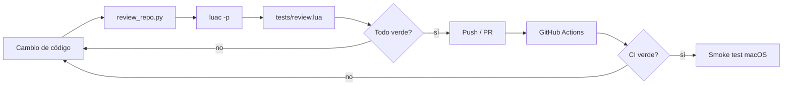

# Code review loop

El repositorio usa un loop de revisión en dos niveles: **estático/CI** y **smoke test en macOS**. El objetivo es separar los errores que pueden detectarse automáticamente de los que dependen de la GUI real de Sonic Pi, permisos de Accessibility, hardware MIDI o audio físico.

## Invariante de ejecución

Hay una regla adicional para el runtime: **Sonic Pi no puede ejecutar un buffer que no coincida estructuralmente con el modelo interno del runner**.

El caso que motivó esta barrera fue un salto de línea perdido durante la escritura automática:

```ruby
sample :bd_haussleep 1
```

cuando el modelo correcto era:

```ruby
sample :bd_haus
sleep 1
```

La defensa ahora tiene varias capas:

1. Los saltos de línea ya no se generan con una pulsación simulada de `Return`; se insertan como texto atómico mediante clipboard + paste.
2. Antes de cada `Run`, Hammerspoon hace `Cmd+A`, `Cmd+C` y lee el contenido **real** del editor desde `hs.pasteboard`.
3. El contenido real se compara con el modelo interno normalizando sólo indentación y finales de línea; los límites entre líneas y las líneas en blanco siguen siendo significativos.
4. Si hay una diferencia, el código **no se ejecuta**. El runner reemplaza el buffer completo con el modelo mediante un paste atómico, hace Tidy y vuelve a copiar/verificar.
5. Sólo existe una ruta hacia `Cmd+R`: una verificación positiva posterior a Tidy.
6. Si la reparación o la segunda verificación falla, la toma queda `dirty`, se cancela el beat y se exige `Ctrl + Alt + Cmd + R`.
7. El portapapeles de texto del usuario se guarda y restaura alrededor de las operaciones internas.

Esto significa que un evento de GUI todavía puede fallar, pero un fallo de escritura ya no puede convertirse silenciosamente en una ejecución de código corrupto.

## Loop automático



`python3 tools/review_repo.py` comprueba la topología del repositorio, inventario, documentación por episodio, ausencia de rutas legacy, clasificación Sonic Pi/VS Code y reglas de estado comunes. También compila los bloques Python documentados y, cuando Ruby está disponible, ejecuta `ruby -c` sobre todos los bloques Sonic Pi/Ruby de `ORIGINAL.md`.

`luac5.4 -p` valida la sintaxis Lua de los módulos, runners y tests.

`lua5.4 tests/review.lua` carga todos los runners con un stub de Hammerspoon. Al construir cada runner, `Runner.reviewSpec()` simula **todos los beats y acciones sobre un modelo textual puro**. La carga falla si existe un `target` inexistente, un tipo de acción desconocido, un `replace_line` multilinea, un nombre de beat duplicado o una estructura de modelo inválida.

El test headless también contiene regresiones explícitas para confirmar que:

- indentación añadida por Sonic Pi/Tidy no causa falsos positivos;
- `sample :bd_haussleep 1` nunca puede compararse como equivalente a `sample :bd_haus\nsleep 1`;
- perder la línea en blanco entre dos `live_loop` también se detecta.

## Qué cubre `Runner.reviewSpec()`

- existencia secuencial de cada `target` usado por `insert_*` y `replace_line`;
- aplicación determinista de `set`, `append`, `append_block`, `prepend`, `insert_before`, `insert_after` y `replace_line`;
- separación de `live_loop` de primer nivel;
- regresión `sample ... sleep ...` fusionados en una sola línea;
- rechazo de `replace_line` con múltiples líneas, porque esa operación fue una fuente de desincronización entre el modelo y el editor;
- snapshot textual después de cada beat y documento final no vacío.

## Qué todavía requiere prueba en la Mac

El CI no puede garantizar el comportamiento de la aplicación Qt de Sonic Pi ni del hardware. Antes de marcar un episodio como listo para grabación se hace una toma corta con:

1. `Ctrl + Alt + Cmd + R` para limpiar runtime y buffer.
2. Recorrer todos los beats con `Ctrl + Alt + Cmd + N`.
3. Confirmar que la consola no reporte una reparación inesperada; si la reporta, comprobar que el código final sea correcto.
4. Confirmar que cualquier divergencia del editor se repare o bloquee antes de `Run`.
5. Escuchar el resultado de cada fase.
6. En EP03, verificar puerto/canal MIDI y el MicroFreak real.
7. En EP06, repetir la prueba cuando `:loop_amen` se sustituya por el sample vocal de producción.

Los episodios 07–09 quedan fuera del smoke test completo hasta implementar la fase VS Code indicada en sus README.

## Criterio de cierre

Un cambio queda aceptado cuando **review_repo.py + sintaxis Lua + review headless + GitHub Actions** están verdes y, para episodios grabables, existe además un smoke test exitoso en macOS/Sonic Pi.
