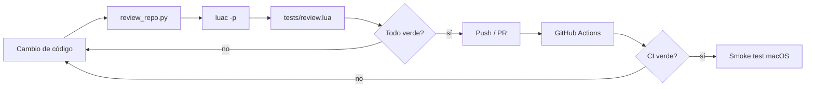

# Code review loop

El repositorio usa un loop de revisión en dos niveles: **estático/CI** y **smoke test en macOS**. El objetivo es separar los errores que pueden detectarse automáticamente de los que dependen de la GUI real de Sonic Pi, permisos de Accessibility, hardware MIDI o audio físico.

## Loop automático

`python3 tools/review_repo.py` comprueba la topología del repositorio, inventario, documentación por episodio, ausencia de rutas legacy, clasificación Sonic Pi/VS Code y reglas de estado comunes. También compila los bloques Python documentados y, cuando Ruby está disponible, ejecuta `ruby -c` sobre todos los bloques Sonic Pi/Ruby de `ORIGINAL.md`.

`luac5.4 -p` valida la sintaxis Lua de los módulos, runners y tests.

`lua5.4 tests/review.lua` carga todos los runners con un stub de Hammerspoon. Al construir cada runner, `Runner.reviewSpec()` simula **todos los beats y acciones sobre un modelo textual puro**. La carga falla si existe un `target` inexistente, un tipo de acción desconocido, un `replace_line` multilinea, un nombre de beat duplicado o una estructura de modelo inválida.

## Qué cubre `Runner.reviewSpec()`

- existencia secuencial de cada `target` usado por `insert_*` y `replace_line`;
- aplicación determinista de `set`, `append`, `append_block`, `prepend`, `insert_before`, `insert_after` y `replace_line`;
- separación de `live_loop` de primer nivel;
- regresión `sample ... sleep ...` fusionados en una sola línea;
- rechazo de `replace_line` con múltiples líneas, porque esa operación fue una fuente de desincronización entre el modelo y el editor;
- snapshot textual después de cada beat y documento final no vacío.

## Qué todavía requiere prueba en la Mac

El CI no puede garantizar el comportamiento de la aplicación Qt de Sonic Pi ni del hardware. Antes de marcar un episodio como listo para grabación se hace una toma corta con:

1. `Ctrl + Alt + Cmd + R` para limpiar runtime y buffer.
2. Recorrer todos los beats con `Ctrl + Alt + Cmd + N`.
3. Confirmar visualmente que no se perdió ningún `Return`.
4. Confirmar que `Cmd+M` y `Cmd+R` actúan sobre el buffer esperado.
5. Escuchar el resultado de cada fase.
6. En EP03, verificar puerto/canal MIDI y el MicroFreak real.
7. En EP06, repetir la prueba cuando `:loop_amen` se sustituya por el sample vocal de producción.

Los episodios 07–09 quedan fuera del smoke test completo hasta implementar la fase VS Code indicada en sus README.

## Criterio de cierre

Un cambio queda aceptado cuando **review_repo.py + sintaxis Lua + review headless + GitHub Actions** están verdes y, para episodios grabables, existe además un smoke test exitoso en macOS/Sonic Pi.
