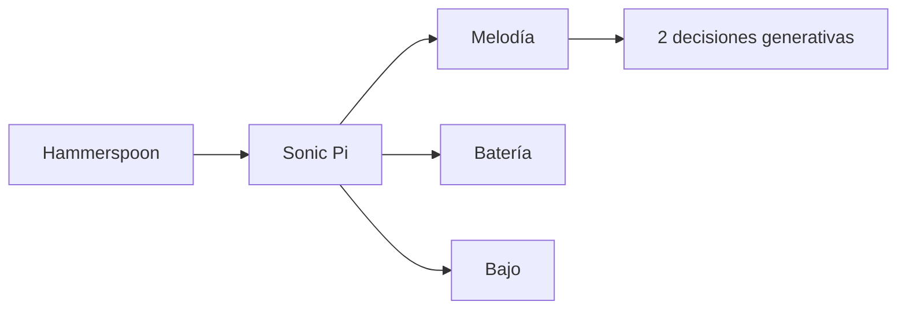

# Episodio 01 — Código → sonido

**Estado:** listo para grabación con Sonic Pi.

El episodio parte de una sola instrucción y construye una mini pieza por acumulación: frase, tempo, `live_loop`, batería, bajo, timbre y dos decisiones generativas limitadas.

## Arquitectura

## Archivos

- `runner.lua` — automatización incremental para cámara.
- [`ORIGINAL.md`](ORIGINAL.md) — código canónico de cada snapshot.

## Automatización

El runner conserva la naturaleza acumulativa del piloto. Los snapshots 5A/5B/5C, 7 y 8 se dividen en beats de grabación más pequeños para que cada cambio sea legible en pantalla.

El episodio es también la referencia para probar el motor compartido: separación de `live_loop`, escritura segura de `sample → sleep`, edición por línea y reset del runtime.

## Verificación de toma

Antes de grabar, recorrer 01→09 completo y confirmar especialmente 05A–05C (saltos de línea), 07A–07C (reemplazos repetidos de notas) y 08A–08B (targets únicos después de las sustituciones previas).
