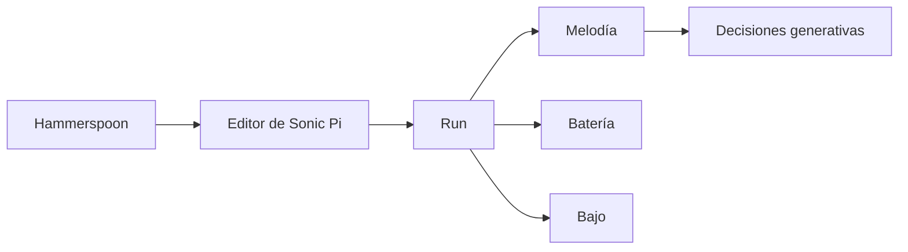

# Episodio 01 — Código → sonido

**Estado:** listo para grabación con Sonic Pi.

Este runner construye progresivamente una pieza desde una sola instrucción hasta una mini-performance con melodía, batería, bajo, elección tímbrica y dos decisiones generativas. Es el episodio de referencia para el motor de escritura incremental y para las pausas seguras entre saltos de línea.

## Archivo

- `runner.lua` — automatización Hammerspoon del episodio.

## Flujo

## Beats automatizados

1. Una instrucción, un sonido.
2. Construir el hook.
3. Fijar el tempo.
4. Convertir la frase en `live_loop`.
5. Añadir kick, snare y hats.
6. Añadir bajo sincopado.
7. Probar `:beep`, `:prophet` y cerrar con `:pluck`.
8. Convertir dos notas en decisiones generativas.
9. Mini-performance final.

## Controles

| Hotkey | Acción |
| --- | --- |
| `Ctrl + Alt + Cmd + R` | Detiene Sonic Pi, limpia el buffer y reinicia la toma. |
| `Ctrl + Alt + Cmd + N` | Ejecuta el siguiente beat de grabación. |
| `Ctrl + Alt + Cmd + I` | Muestra en consola cuál es el siguiente beat. |
| `Ctrl + Alt + Cmd + X` | Cancela la automatización y marca la toma como desincronizada. |
| `Ctrl + Alt + Cmd + T` | Prueba mínima de escritura. |

Los mensajes siempre se registran en la consola de Hammerspoon. Las alertas visuales son opcionales y están deshabilitadas por defecto.
