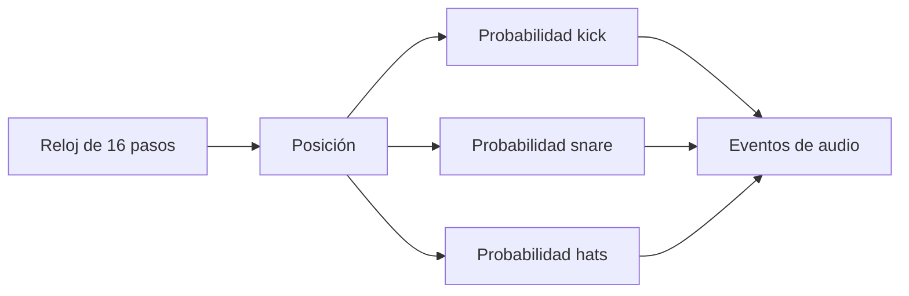

# Episodio 02 — La máquina decide el ritmo

**Estado:** listo para grabación con Sonic Pi.

El protagonista es la relación **posición → probabilidad → decisión → resultado rítmico**. Un solo `live_loop` recorre 16 pasos y decide kick, snare y hi-hat sin almacenar un patrón final.

## Arquitectura

## Archivos

- `runner.lua` — añade las reglas de cada voz dentro del mismo loop.
- [`ORIGINAL.md`](ORIGINAL.md) — código canónico de los cinco snapshots.

## Decisión de automatización

Snapshots 2 y 3 se insertan justo antes del `sleep 0.25`, de modo que las tres voces se evalúan en la misma posición temporal. Snapshot 5 cambia un solo número (`0.35 → 0.80`) para conservar la comparación pedagógica.

## Verificación de toma

Escuchar varias vueltas antes y después del beat 05; la variación entre ciclos es intencional y no debe confundirse con un error del runner.
