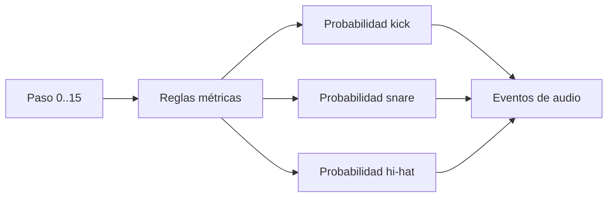

# Episodio 02 — La máquina decide el ritmo

**Estado:** listo para grabación con Sonic Pi.

El episodio construye un único `live_loop` de 16 pasos. Kick, snare y hi-hat no forman un patrón fijo: cada voz evalúa reglas de posición y probabilidad en cada vuelta.

## Archivo

- `runner.lua` — automatización Hammerspoon del episodio.

## Flujo

## Beats automatizados

1. Kick probabilístico.
2. Backbeat probabilístico.
3. Hi-hat como densidad.
4. Escuchar las tres voces juntas.
5. Cambiar un solo valor para aumentar la densidad del hi-hat.

## Controles

| Hotkey | Acción |
| --- | --- |
| `Ctrl + Alt + Cmd + R` | Detiene Sonic Pi, limpia el buffer y reinicia la toma. |
| `Ctrl + Alt + Cmd + N` | Ejecuta el siguiente beat de grabación. |
| `Ctrl + Alt + Cmd + I` | Muestra en consola cuál es el siguiente beat. |
| `Ctrl + Alt + Cmd + X` | Cancela la automatización y marca la toma como desincronizada. |
| `Ctrl + Alt + Cmd + T` | Prueba mínima de escritura. |

Los mensajes siempre se registran en la consola de Hammerspoon. Las alertas visuales son opcionales y están deshabilitadas por defecto.
