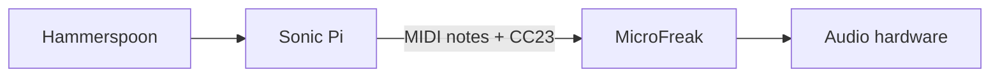

# Episodio 03 — Controlando un sinte desde el código

**Estado:** listo para grabación con Sonic Pi + hardware MIDI.

Sonic Pi no genera el audio principal: envía notas y CC al sintetizador. El episodio demuestra una secuencia de 8 notas y un ciclo de 5 valores de cutoff que producen una relación de 40 pasos antes de repetirse.

## Arquitectura



## Archivos

- `runner.lua` — estados autocontenidos para cada snapshot y versión robusta final.
- [`ORIGINAL.md`](ORIGINAL.md) — código canónico, incluido el placeholder `<microfreak_port>`.

## Configuración

En `~/.hammerspoon/init.lua`:

```lua
GLITX_EP03_CONFIG = {
  midiPort = "NOMBRE EXACTO DEL PUERTO",
}
```

El runner escapa el nombre como string Ruby antes de insertarlo en Sonic Pi.

## Decisión de automatización

Los snapshots 1–4 reemplazan el buffer completo porque son demostraciones autocontenidas. El beat 05 ejecuta ambos ciclos simples; 05B sustituye el buffer por la variante sincronizada con `cue/sync`, preferida para la grabación final.

## Verificación de toma

Confirmar puerto, canal 1 y mapeo `CC23 → cutoff` en el MicroFreak real antes de grabar. El CI sólo puede revisar sintaxis/modelo; no puede comprobar el hardware.
