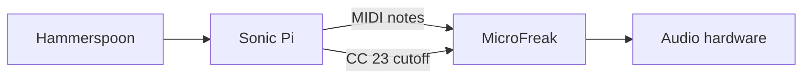

# Episodio 03 — Controlando un sinte desde el código

**Estado:** listo para grabación desde Sonic Pi; requiere MicroFreak conectado por MIDI.

No necesita código externo. Sonic Pi genera los mensajes MIDI y el audio proviene del sintetizador hardware.

## Configuración del puerto MIDI

Antes de cargar el runner, define el puerto que Sonic Pi muestra en **Preferences → IO**:

```lua
GLITX_EP03_CONFIG = {
  midiPort = "NOMBRE EXACTO DEL PUERTO",
}
```

Si no se configura, el runner usa `"<microfreak_port>"` como placeholder y deja una advertencia en consola.

## Archivo

- `runner.lua` — automatización Hammerspoon del episodio.

## Flujo



## Beats automatizados

1. Una nota MIDI.
2. Secuencia fija de ocho notas.
3. Demostración directa de CC23.
4. Ciclo independiente de cutoff.
5. Versión robusta con reloj compartido y ciclos de longitudes 8 y 5.
6. Performance final.

## Controles

| Hotkey | Acción |
| --- | --- |
| `Ctrl + Alt + Cmd + R` | Detiene Sonic Pi, limpia el buffer y reinicia la toma. |
| `Ctrl + Alt + Cmd + N` | Ejecuta el siguiente beat de grabación. |
| `Ctrl + Alt + Cmd + I` | Muestra en consola cuál es el siguiente beat. |
| `Ctrl + Alt + Cmd + X` | Cancela la automatización y marca la toma como desincronizada. |
| `Ctrl + Alt + Cmd + T` | Prueba mínima de escritura. |

Los mensajes siempre se registran en la consola de Hammerspoon. Las alertas visuales son opcionales y están deshabilitadas por defecto.
