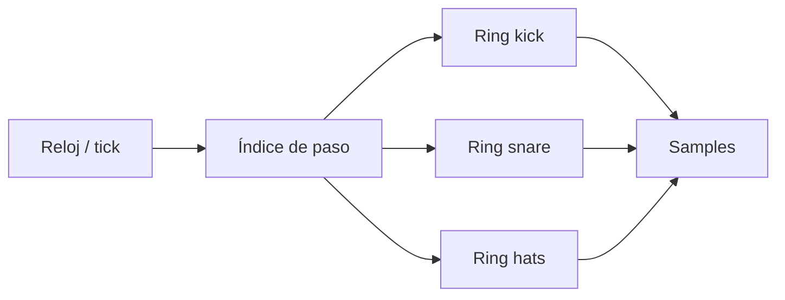

# Episodio 04 — Construye tu propio secuenciador

**Estado:** listo para grabación con Sonic Pi.

El episodio hace visible la relación entre **paso → dato → evento**. Primero aparece el reloj, luego una partitura de kick, después snare y hats, y finalmente se modifica el groove sin tocar el motor de reproducción.

## Archivo

- `runner.lua` — automatización Hammerspoon del episodio.

## Flujo

## Beats automatizados

1. Reloj de 16 pasos.
2. Patrón de kick.
3. Kick + snare.
4. Tres voces.
5. Cambiar el kick sin cambiar el motor.
6. Estado final de performance.

## Controles

| Hotkey | Acción |
| --- | --- |
| `Ctrl + Alt + Cmd + R` | Detiene Sonic Pi, limpia el buffer y reinicia la toma. |
| `Ctrl + Alt + Cmd + N` | Ejecuta el siguiente beat de grabación. |
| `Ctrl + Alt + Cmd + I` | Muestra en consola cuál es el siguiente beat. |
| `Ctrl + Alt + Cmd + X` | Cancela la automatización y marca la toma como desincronizada. |
| `Ctrl + Alt + Cmd + T` | Prueba mínima de escritura. |

Los mensajes siempre se registran en la consola de Hammerspoon. Las alertas visuales son opcionales y están deshabilitadas por defecto.
