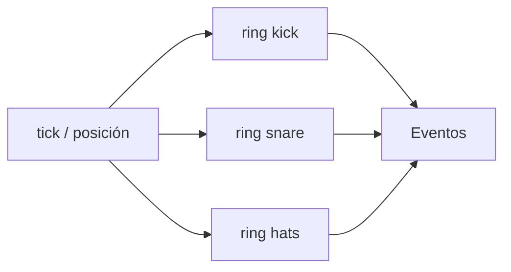

# Episodio 04 — Construye tu propio secuenciador

**Estado:** listo para grabación con Sonic Pi.

El episodio separa **motor** y **datos**: el `live_loop` sólo consulta la posición actual; kick, snare y hats viven en rings de 16 pasos.

## Arquitectura

## Archivos

- `runner.lua` — construcción incremental del secuenciador.
- [`ORIGINAL.md`](ORIGINAL.md) — seis snapshots canónicos.

## Decisión de automatización

Después de establecer el motor, los beats 03 y 04 sólo insertan datos y una nueva consulta de sample. Los beats 05 y 06 cambian rings, no el `live_loop`, para hacer visible la separación entre partitura y motor.

## Verificación de toma

En el beat 05 confirmar que ninguna línea dentro de `live_loop :sequencer` cambió; en el 06 deben cambiar únicamente snare y hats respecto al estado anterior.
