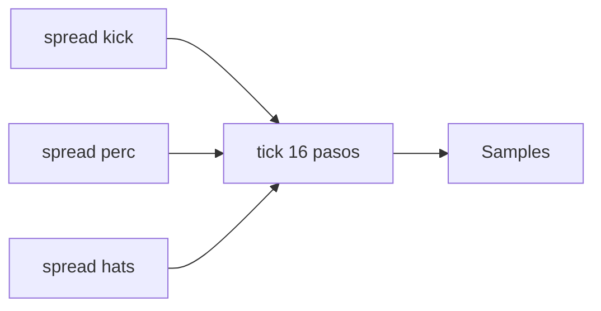

# Episodio 05 — Ritmos euclidianos

**Estado:** listo para grabación con Sonic Pi.

El código mantiene visible `spread(pulsos, pasos)` para que la idea euclidiana no quede oculta por abstracciones auxiliares.

## Arquitectura

## Archivos

- `runner.lua` — evolución incremental y comparación A/B explícita.
- [`ORIGINAL.md`](ORIGINAL.md) — siete snapshots canónicos.

## Decisión de automatización

El snapshot 7 contiene dos configuraciones. El runner lo divide en `07A` y `07B`: primero regresa explícitamente a Version A `(5,3,7)` y después cambia a Version B `(7,5,11)`. Esto corrige la ambigüedad de saltar directamente desde el snapshot 6, donde hats ya estaba en `11/16`.

## Verificación de toma

Escuchar 3/8 vs 5/8, 7/16 vs 11/16 y finalmente A vs B. El motor de reproducción debe permanecer idéntico durante toda la comparación.
