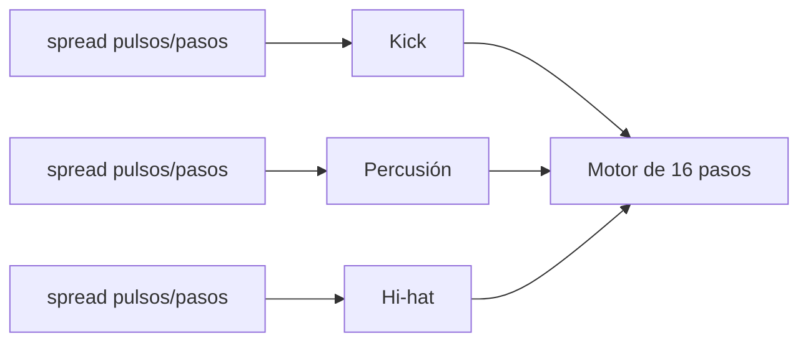

# Episodio 05 — Ritmos euclidianos

**Estado:** listo para grabación con Sonic Pi.

El protagonista es `spread(pulsos, pasos)`. El runner evita esconder esa relación en helpers y transforma gradualmente una sola distribución en un groove de tres voces.

## Archivo

- `runner.lua` — automatización Hammerspoon del episodio.

## Flujo

## Beats automatizados

1. `spread(3, 8)`.
2. Comparación con `spread(5, 8)`.
3. Rejilla de 16 pasos.
4. Segunda distribución.
5. Tercera voz.
6. Cambiar sólo hats `7 → 11`.
7. Performance A/B con tres cifras nuevas.

## Controles

| Hotkey | Acción |
| --- | --- |
| `Ctrl + Alt + Cmd + R` | Detiene Sonic Pi, limpia el buffer y reinicia la toma. |
| `Ctrl + Alt + Cmd + N` | Ejecuta el siguiente beat de grabación. |
| `Ctrl + Alt + Cmd + I` | Muestra en consola cuál es el siguiente beat. |
| `Ctrl + Alt + Cmd + X` | Cancela la automatización y marca la toma como desincronizada. |
| `Ctrl + Alt + Cmd + T` | Prueba mínima de escritura. |

Los mensajes siempre se registran en la consola de Hammerspoon. Las alertas visuales son opcionales y están deshabilitadas por defecto.
