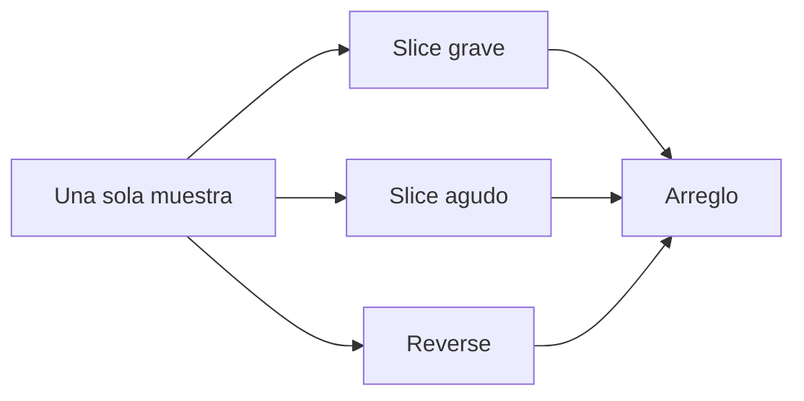

# Episodio 06 — Un sample, cien sonidos

**Estado:** listo para automatización Sonic Pi; pendiente sustituir la fuente de desarrollo por el sample vocal de producción.

La restricción del episodio es usar **una sola fuente** y obtener funciones distintas mediante slicing, `rate` y reproducción inversa.

## Arquitectura

## Archivos

- `runner.lua` — usa `:loop_amen` para que todas las pruebas sean reproducibles.
- [`ORIGINAL.md`](ORIGINAL.md) — nueve snapshots canónicos.

## Decisión de automatización

El snapshot 3 se implementa con dos acciones (`replace_line` + `append`) y no con un reemplazo multilinea; esto mantiene sincronizado el modelo del runner con la edición real. Snapshots 5–7 construyen el arreglo por `append_block`.

## Producción

Antes de la toma final se puede sustituir `:loop_amen` por la grabación de “Glitxtober”. Ajustar `start`/`finish` por oído sin cambiar la arquitectura del episodio.

## Verificación de toma

Comprobar que **todas** las llamadas `sample` siguen apuntando a la misma fuente y que el cambio final sólo modifica `rate: 2.0 → 1.5` en `:high_ticks`.
