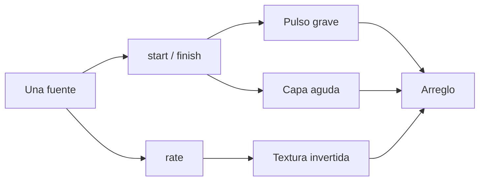

# Episodio 06 — Un sample, cien sonidos

**Estado:** listo para grabación con Sonic Pi.

La automatización usa exclusivamente `:loop_amen` para que todo sea reproducible sin archivos externos. En producción puede sustituirse por la grabación vocal de “Glitxtober” manteniendo la misma arquitectura.

## Archivo

- `runner.lua` — automatización Hammerspoon del episodio.

## Flujo

## Beats automatizados

1. Escuchar la fuente.
2. Seleccionar un fragmento.
3. Comparar dos velocidades.
4. Reproducir al revés.
5. Crear el pulso grave.
6. Añadir la capa aguda.
7. Añadir textura invertida.
8. Escuchar el arreglo completo.
9. Mutar únicamente el `rate` de `:high_ticks`.

## Nota de producción

Para la toma con la voz de “Glitxtober”, ajustar `start` y `finish` por oído después de elegir el archivo definitivo. Esto no requiere código externo; sólo cambiar la fuente y los puntos de corte dentro de Sonic Pi.

## Controles

| Hotkey | Acción |
| --- | --- |
| `Ctrl + Alt + Cmd + R` | Detiene Sonic Pi, limpia el buffer y reinicia la toma. |
| `Ctrl + Alt + Cmd + N` | Ejecuta el siguiente beat de grabación. |
| `Ctrl + Alt + Cmd + I` | Muestra en consola cuál es el siguiente beat. |
| `Ctrl + Alt + Cmd + X` | Cancela la automatización y marca la toma como desincronizada. |
| `Ctrl + Alt + Cmd + T` | Prueba mínima de escritura. |

Los mensajes siempre se registran en la consola de Hammerspoon. Las alertas visuales son opcionales y están deshabilitadas por defecto.
