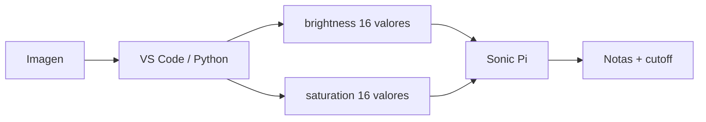

# Episodio 07 — La imagen se convierte en música

**Estado:** 🟡 TODO — fase VS Code / Python.

La parte Sonic Pi ya está definida, pero el episodio necesita un extractor de imagen en Python para generar 16 valores de brillo y 16 de saturación.

## Arquitectura

## Código original

Todo el código de las cinco fases está preservado en [`ORIGINAL.md`](ORIGINAL.md), incluido el extractor Python de referencia.

## TODO VS Code

- crear `image_features.py`;
- elegir/validar Imagen A e Imagen B;
- automatizar apertura/ejecución desde Hammerspoon;
- transferir o pegar los arrays resultantes en Sonic Pi;
- decidir si la captura muestra VS Code completo o sólo el resultado de consola;
- añadir runner sólo cuando el flujo Python → Sonic Pi sea reproducible.

No se crea `runner.lua` todavía para evitar documentar como “terminado” un flujo que depende de código externo.
