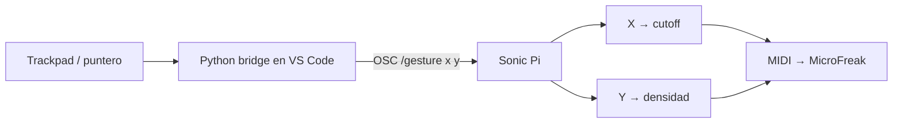

# Episodio 08 — Convierte tu trackpad en un instrumento

**Estado:** TODO — requiere una etapa posterior en VS Code.

El episodio necesita un bridge en Python que convierta movimiento X/Y en mensajes OSC. Sonic Pi recibe esos valores, cuantiza X en estados de cutoff y Y en cuatro densidades rítmicas, y después envía MIDI al MicroFreak.

## Arquitectura prevista

## TODO — fase VS Code

- Crear `gesture_bridge.py`.
- Confirmar la librería OSC y el puerto `4560`.
- Definir la superficie gestual definitiva para grabación.
- Configurar el puerto MIDI real del MicroFreak.
- Automatizar el cambio de foco VS Code ↔ Sonic Pi con Hammerspoon.
- Crear el runner final cuando el bridge sea estable.
