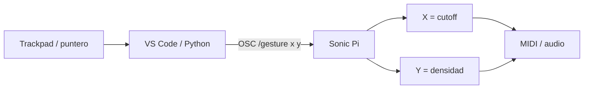

# Episodio 08 — Convierte tu trackpad en un instrumento

**Estado:** 🟡 TODO — fase VS Code / Python + OSC.

Un bridge Python convierte movimiento X/Y en OSC; Sonic Pi transforma X en estados de cutoff y Y en densidades rítmicas.

## Arquitectura

## Código original

Las seis fases, incluido el bridge `tkinter + python-osc`, están en [`ORIGINAL.md`](ORIGINAL.md).

## TODO VS Code

- crear `gesture_bridge.py`;
- fijar dependencias/entorno Python;
- validar OSC hacia `127.0.0.1:4560`;
- configurar el puerto MIDI del sinte para el snapshot 5;
- automatizar lanzamiento/parada del bridge;
- diseñar el runner multiprograma Hammerspoon (VS Code ↔ Sonic Pi);
- hacer prueba de zonas X/Y antes de grabar.
