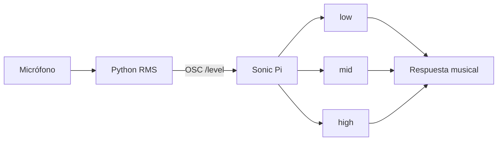

# Episodio 09 — La computadora escucha y responde

**Estado:** 🟡 TODO — fase VS Code / Python + audio + OSC.

El episodio calcula nivel RMS del micrófono en Python, lo envía por OSC y Sonic Pi lo convierte en tres estados musicales.

## Arquitectura

## Código original

Las seis fases, incluido el analizador `numpy + sounddevice + python-osc`, están en [`ORIGINAL.md`](ORIGINAL.md).

## TODO VS Code

- crear `audio_level_bridge.py`;
- fijar dispositivo, samplerate y permisos de micrófono;
- calibrar `GAIN` y umbrales con la interfaz real;
- evaluar histéresis sólo si la señal oscila entre estados;
- automatizar bridge + Sonic Pi con Hammerspoon;
- documentar el procedimiento de calibración de la toma final.
