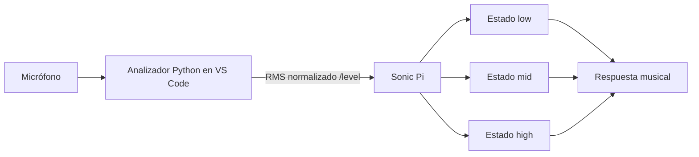

# Episodio 09 — La computadora escucha y responde

**Estado:** TODO — requiere una etapa posterior en VS Code.

La lógica musical puede probarse en Sonic Pi con un nivel manual, pero el episodio completo necesita un analizador Python que mida RMS del micrófono y envíe `/level` por OSC.

## Arquitectura prevista

## TODO — fase VS Code

- Crear `audio_level_bridge.py` con `numpy`, `sounddevice` y OSC.
- Calibrar `GAIN` con el micrófono definitivo.
- Validar los umbrales `0.25` y `0.60`.
- Decidir si hace falta histéresis después de probar la entrada real.
- Automatizar el flujo VS Code ↔ Sonic Pi para grabación.
- Crear el runner final después de estabilizar análisis y calibración.
