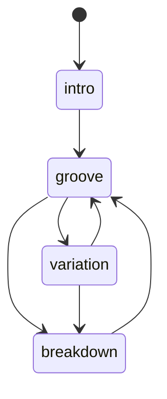

# Episodio 10 — Una máquina que hace música sola

**Estado:** listo para grabación con Sonic Pi.

El episodio construye una máquina de estados musical: las capas leen un estado global y un director decide transiciones válidas. La aleatoriedad está acotada y sembrada.

## Arquitectura

## Archivos

- `runner.lua` — evolución desde estado global hasta performance completa.
- [`ORIGINAL.md`](ORIGINAL.md) — ocho snapshots canónicos.

## Decisión de automatización

Los primeros beats conservan el desarrollo pedagógico; el beat 05 reemplaza el buffer por una versión autocontenida con `next_state`, seed, drums y director. Los beats 06 y 07 añaden bajo y motivo como bloques independientes.

## Verificación de toma

Confirmar que la seed sea `2026`, que no aparezcan estados fuera de `intro/groove/variation/breakdown` y que bass/motif sólo reaccionen a los estados documentados.
