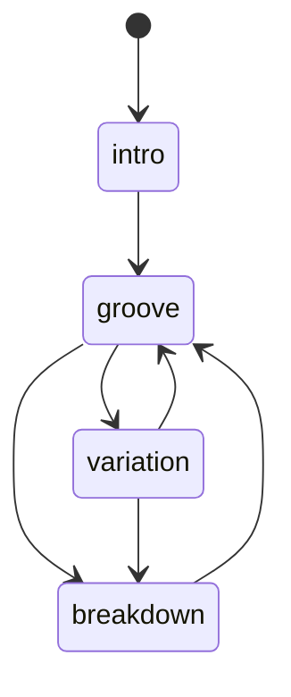
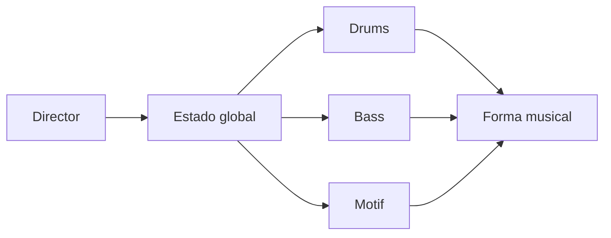

# Episodio 10 — Una máquina que hace música sola

**Estado:** listo para grabación con Sonic Pi.

El episodio introduce una máquina de estados: las capas consultan un estado global y un director cambia la forma. La aleatoriedad sólo elige transiciones válidas o pequeñas variaciones internas.

## Archivo

- `runner.lua` — automatización Hammerspoon del episodio.

## Flujo

## Beats automatizados

1. Estado global.
2. Drums condicionados por estado.
3. Director determinista.
4. Tabla de transiciones.
5. Director autónomo reproducible con seed.
6. Bajo condicionado por estado.
7. Motivo con memoria de estado.
8. Performance final.

## Controles

| Hotkey | Acción |
| --- | --- |
| `Ctrl + Alt + Cmd + R` | Detiene Sonic Pi, limpia el buffer y reinicia la toma. |
| `Ctrl + Alt + Cmd + N` | Ejecuta el siguiente beat de grabación. |
| `Ctrl + Alt + Cmd + I` | Muestra en consola cuál es el siguiente beat. |
| `Ctrl + Alt + Cmd + X` | Cancela la automatización y marca la toma como desincronizada. |
| `Ctrl + Alt + Cmd + T` | Prueba mínima de escritura. |

Los mensajes siempre se registran en la consola de Hammerspoon. Las alertas visuales son opcionales y están deshabilitadas por defecto.
